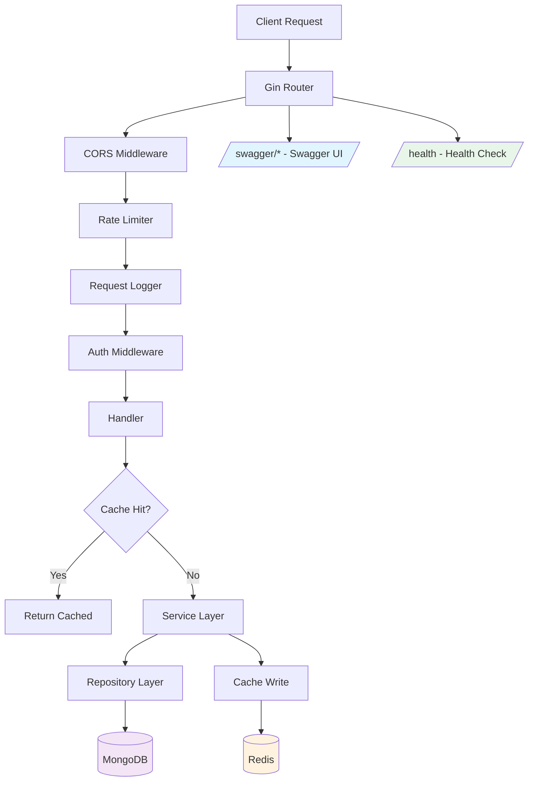

# Phase 6: Swagger Documentation & Backend Optimization

## Overview
Add comprehensive Swagger/OpenAPI documentation to all backend endpoints and optimize the backend with MongoDB indexes, Redis caching, structured logging, rate limiting, pagination, and graceful shutdown improvements.

## Current State Analysis

### API Surface (30 endpoints across 9 route groups)

| Group | Method | Path | Handler | Description |
|-------|--------|------|---------|-------------|
| **Auth** | POST | `/api/v1/auth/verify-token` | `AuthHandler.VerifyToken` | Verify Firebase token |
| | GET | `/api/v1/auth/me` | `AuthHandler.GetMe` | Get current user profile |
| | PUT | `/api/v1/auth/profile` | `AuthHandler.UpdateProfile` | Update profile |
| **Groups** | POST | `/api/v1/groups` | `GroupHandler.CreateGroup` | Create group |
| | GET | `/api/v1/groups` | `GroupHandler.ListGroups` | List user groups |
| | POST | `/api/v1/groups/join` | `GroupHandler.JoinGroup` | Join via invite code |
| | GET | `/api/v1/groups/:id` | `GroupHandler.GetGroup` | Get group details |
| | PUT | `/api/v1/groups/:id` | `GroupHandler.UpdateGroup` | Update group |
| | DELETE | `/api/v1/groups/:id` | `GroupHandler.DeleteGroup` | Delete group |
| | POST | `/api/v1/groups/:id/members` | `GroupHandler.AddMember` | Add member |
| | DELETE | `/api/v1/groups/:id/members/:userId` | `GroupHandler.RemoveMember` | Remove member |
| | POST | `/api/v1/groups/:id/bills` | `BillHandler.CreateBill` | Create bill in group |
| | GET | `/api/v1/groups/:id/bills` | `BillHandler.ListBills` | List group bills |
| | GET | `/api/v1/groups/:id/balances` | `BillHandler.GetGroupBalances` | Get group balances |
| | GET | `/api/v1/groups/:id/settlements` | `BillHandler.GetSettlements` | Get settlement plan |
| | GET | `/api/v1/groups/:id/activities` | `ActivityHandler.GetGroupActivities` | Group activity feed |
| | GET | `/api/v1/groups/:id/stats` | `StatsHandler.GetGroupStats` | Group statistics |
| | GET | `/api/v1/groups/:id/stats/categories` | `StatsHandler.GetGroupCategoryStats` | Category breakdown |
| | GET | `/api/v1/groups/:id/export` | `StatsHandler.ExportGroupSummary` | Export summary |
| **Bills** | GET | `/api/v1/bills/:id` | `BillHandler.GetBill` | Get bill detail |
| | PUT | `/api/v1/bills/:id` | `BillHandler.UpdateBill` | Update bill |
| | DELETE | `/api/v1/bills/:id` | `BillHandler.DeleteBill` | Delete bill |
| **Transactions** | POST | `/api/v1/transactions` | `TransactionHandler.CreateTransaction` | Create transaction |
| | PUT | `/api/v1/transactions/:id/confirm` | `TransactionHandler.ConfirmTransaction` | Confirm transaction |
| **Users** | GET | `/api/v1/users/me/debts` | `TransactionHandler.GetUserDebts` | Get user debts |
| **OCR** | POST | `/api/v1/ocr/scan` | `OCRHandler.ScanReceipt` | Scan receipt URL |
| | POST | `/api/v1/ocr/scan-base64` | `OCRHandler.ScanReceiptBase64` | Scan receipt base64 |
| | GET | `/api/v1/ocr/:id/result` | `OCRHandler.GetOCRResult` | Get OCR result |
| | POST | `/api/v1/ocr/:id/confirm` | `OCRHandler.ConfirmOCR` | Confirm OCR to bill |
| | GET | `/api/v1/ocr/pending` | `OCRHandler.GetPendingScans` | Get pending scans |
| **Upload** | POST | `/api/v1/upload/image` | `ImageHandler.UploadImage` | Upload image file |
| | POST | `/api/v1/upload/image-base64` | `ImageHandler.UploadBase64Image` | Upload base64 image |
| **Payment** | POST | `/api/v1/payment/deeplink` | `PaymentHandler.GenerateDeeplink` | Generate bank deeplink |
| | POST | `/api/v1/payment/vietqr` | `PaymentHandler.GenerateVietQR` | Generate VietQR |
| | GET | `/api/v1/payment/user/:userId` | `PaymentHandler.GetUserPaymentInfo` | Get user payment info |
| | GET | `/api/v1/payment/banks` | `PaymentHandler.GetSupportedBanks` | List supported banks |
| **Activity** | GET | `/api/v1/activities/me` | `ActivityHandler.GetUserActivities` | User activity feed |
| **Stats** | GET | `/api/v1/stats/me` | `StatsHandler.GetUserStats` | User overall stats |
| **Categories** | GET | `/api/v1/categories` | `StatsHandler.GetCategoryList` | List bill categories |

### Current Issues Found
1. **No MongoDB indexes** — All queries scan full collections
2. **Redis initialized but never used** — Wasted connection, no caching
3. **No request logging** — Only Gin default logger, no structured logging
4. **No rate limiting** — Vulnerable to abuse
5. **No pagination** — List endpoints return all results
6. **No input validation middleware** — Validation is ad-hoc in handlers
7. **Graceful shutdown** incomplete — Server starts in goroutine but no context propagation

---

## Implementation Plan

### 1. Swagger/OpenAPI Documentation

**Approach:** Use `swaggo/swag` with `gin-swagger` — the standard Go Swagger solution.

**Files to create/modify:**

```
split-bill-backend/
├── docs/                          # Auto-generated by swag
│   ├── docs.go
│   ├── swagger.json
│   └── swagger.yaml
├── cmd/server/main.go             # Add swagger route + general API info annotation
├── internal/handlers/
│   ├── auth_handler.go            # Add @Summary, @Tags, @Param, @Success annotations
│   ├── group_handler.go           # Add annotations
│   ├── bill_handler.go            # Add annotations
│   ├── transaction_handler.go     # Add annotations
│   ├── ocr_handler.go             # Add annotations
│   ├── image_handler.go           # Add annotations
│   ├── payment_handler.go         # Add annotations
│   ├── activity_handler.go        # Add annotations
│   └── stats_handler.go           # Add annotations
└── internal/models/               # Swagger reads struct tags for schema generation
```

**Swagger annotation pattern for each handler:**
```go
// CreateGroup creates a new group
// @Summary Create a new group
// @Description Creates a new group with the authenticated user as creator
// @Tags Groups
// @Accept json
// @Produce json
// @Param request body models.CreateGroupRequest true "Group creation data"
// @Success 201 {object} utils.APIResponse{data=models.GroupResponse}
// @Failure 400 {object} utils.APIResponse
// @Failure 401 {object} utils.APIResponse
// @Security BearerAuth
// @Router /api/v1/groups [post]
```

**Dependencies to add:**
- `github.com/swaggo/swag/cmd/swag` — CLI tool for generating docs
- `github.com/swaggo/gin-swagger` — Gin middleware
- `github.com/swaggo/files` — Swagger UI static files

### 2. MongoDB Index Optimization

**File:** `split-bill-backend/internal/database/indexes.go` (new)

**Indexes to create:**

| Collection | Index Fields | Type | Rationale |
|-----------|-------------|------|-----------|
| `users` | `firebase_uid` | Unique | Auth middleware lookups on every request |
| `users` | `phone` | Sparse | Phone number lookups |
| `groups` | `members.user_id` | Regular | `FindByMemberUserID` — most frequent query |
| `groups` | `invite_code` | Unique, Sparse | Join by invite code |
| `bills` | `group_id` | Regular | `FindByGroupID` — list bills per group |
| `bills` | `group_id, status` | Compound | `FindActiveByGroupID` — active bills filter |
| `bills` | `created_by` | Regular | User bill lookups |
| `bills` | `category` | Regular | Category stats queries |
| `transactions` | `group_id` | Regular | Group transaction lookups |
| `transactions` | `from_user, to_user` | Compound | User debt queries |
| `transactions` | `status` | Regular | Pending transaction filters |
| `activities` | `group_id, created_at` | Compound desc | Activity feed sorted by time |
| `activities` | `user_id, created_at` | Compound desc | User activity feed |
| `ocr_results` | `user_id, status` | Compound | Pending scans by user |
| `ocr_results` | `group_id` | Regular | Group OCR results |

### 3. Redis Caching Layer

**File:** `split-bill-backend/internal/cache/cache.go` (new)

**Caching strategy:**

| Data | Cache Key | TTL | Invalidation |
|------|-----------|-----|-------------|
| User by Firebase UID | `user:fb:{uid}` | 5 min | On profile update |
| Group by ID | `group:{id}` | 2 min | On group update/member change |
| User groups list | `user_groups:{userId}` | 2 min | On group join/leave/create |
| Bill categories list | `categories` | 24 hours | Static data |
| Group stats | `stats:group:{id}` | 5 min | On bill create/delete |
| User stats | `stats:user:{id}` | 5 min | On bill create/delete |

**Implementation:** Create a `CacheService` struct injected into services that need it, wrapping Redis get/set/delete with JSON serialization.

### 4. Request Logging Middleware

**File:** `split-bill-backend/internal/middleware/logger.go` (new)

**Features:**
- Structured JSON logging with `zap`
- Request ID generation (UUID)
- Log: method, path, status, latency, client IP, user agent
- Request ID propagated via context for tracing
- Skip health check endpoint from logging

### 5. Rate Limiting Middleware

**File:** `split-bill-backend/internal/middleware/rate_limit.go` (new)

**Strategy:** Token bucket per IP using Redis (or in-memory fallback)
- General API: 100 requests/minute
- Auth endpoints: 20 requests/minute
- OCR endpoints: 10 requests/minute (expensive Vision API calls)
- Upload endpoints: 20 requests/minute

### 6. Pagination Support

**File:** `split-bill-backend/internal/utils/pagination.go` (new)

**Standard pagination query params:**
- `page` (default: 1)
- `limit` (default: 20, max: 100)

**Response format:**
```json
{
  "success": true,
  "data": [...],
  "pagination": {
    "page": 1,
    "limit": 20,
    "total": 150,
    "total_pages": 8
  }
}
```

**Endpoints to paginate:**
- `GET /groups` — list groups
- `GET /groups/:id/bills` — list bills
- `GET /groups/:id/activities` — activity feed
- `GET /activities/me` — user activities
- `GET /ocr/pending` — pending scans

### 7. Graceful Shutdown Improvement

**File:** Modify `split-bill-backend/cmd/server/main.go`

**Changes:**
- Use `http.Server` instead of `router.Run()` for proper shutdown control
- Context cancellation propagated to all services
- Configurable shutdown timeout (default 10s)
- Drain active connections before exit

---

## Architecture Diagram



## Execution Order

The tasks should be implemented in this order for minimal disruption:

1. **Swagger annotations** on all handlers — no code logic changes
2. **Swagger setup** in main.go — add route + generate docs
3. **MongoDB indexes** — pure additive, no logic changes
4. **Pagination utility** — add helper, then update list handlers
5. **Redis caching** — create cache service, inject into services
6. **Request logging** — add middleware to chain
7. **Rate limiting** — add middleware to chain
8. **Graceful shutdown** — refactor main.go server startup
9. **Build verification** — `go build ./...`
