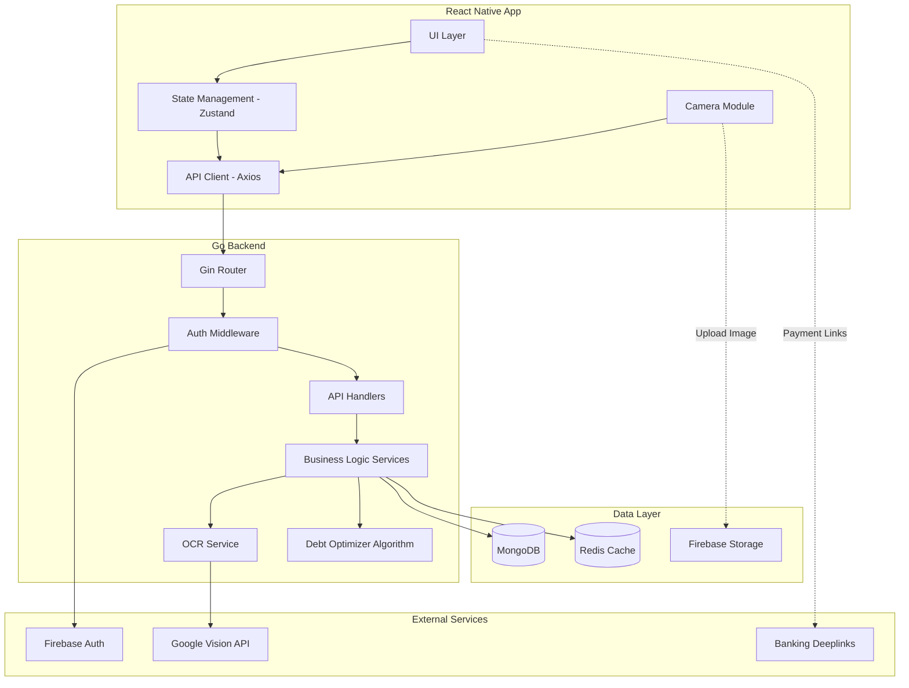
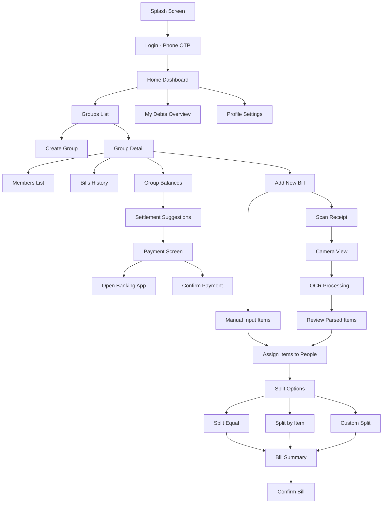
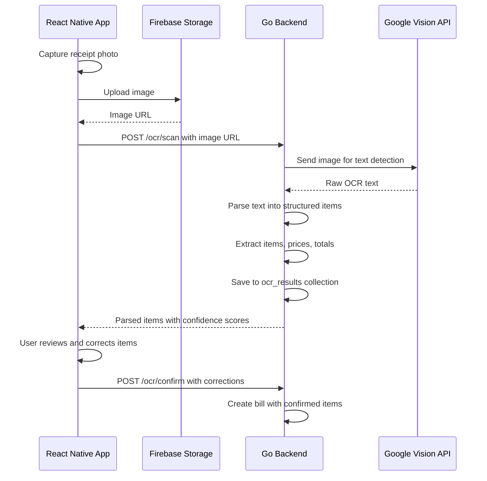

# Split Bill App - Architecture Plan

## 🎯 Overview

Smart group bill splitting app for dining/traveling - allows users to create groups, scan receipts via OCR, split bills evenly or by items, track debts, and suggest optimal payment settlements.

---

## 🛠 Final Tech Stack

| Layer | Technology | Reason |
|-------|-----------|--------|
| **Mobile** | React Native CLI + TypeScript | Full control, native performance |
| **Backend** | Go (Gin/Fiber framework) | High performance, concurrency, single binary deploy |
| **Database** | MongoDB | Flexible schema for receipts/transactions |
| **Cache** | Redis | Session management, real-time debt calculations |
| **OCR** | Google Cloud Vision API | High accuracy, Vietnamese text support |
| **Auth** | Firebase Auth | Phone OTP, Google/Facebook login |
| **Storage** | Firebase Storage / S3 | Receipt image storage |
| **Push Notifications** | Firebase Cloud Messaging | Real-time updates |

---

## 🏗 System Architecture



---

## 📊 Database Schema Design

### Collection: `users`
```json
{
  "_id": "ObjectId",
  "firebase_uid": "string",
  "phone": "string",
  "display_name": "string",
  "avatar_url": "string",
  "bank_accounts": [
    {
      "bank_code": "string",
      "account_number": "string",
      "account_name": "string"
    }
  ],
  "preferred_payment": "string",
  "created_at": "datetime",
  "updated_at": "datetime"
}
```

### Collection: `groups`
```json
{
  "_id": "ObjectId",
  "name": "string",
  "description": "string",
  "avatar_url": "string",
  "created_by": "ObjectId (ref: users)",
  "members": [
    {
      "user_id": "ObjectId (ref: users)",
      "nickname": "string",
      "role": "admin | member",
      "joined_at": "datetime"
    }
  ],
  "invite_code": "string",
  "is_active": "boolean",
  "created_at": "datetime",
  "updated_at": "datetime"
}
```

### Collection: `bills`
```json
{
  "_id": "ObjectId",
  "group_id": "ObjectId (ref: groups)",
  "title": "string",
  "description": "string",
  "receipt_image_url": "string",
  "total_amount": "number",
  "currency": "string (VND)",
  "paid_by": "ObjectId (ref: users)",
  "split_type": "equal | by_item | by_percentage | by_amount",
  "items": [
    {
      "_id": "ObjectId",
      "name": "string",
      "quantity": "number",
      "unit_price": "number",
      "total_price": "number",
      "assigned_to": ["ObjectId (ref: users)"]
    }
  ],
  "extra_charges": {
    "tax": "number",
    "service_charge": "number",
    "tip": "number",
    "discount": "number"
  },
  "splits": [
    {
      "user_id": "ObjectId (ref: users)",
      "amount": "number",
      "is_paid": "boolean",
      "paid_at": "datetime"
    }
  ],
  "status": "pending | settled | cancelled",
  "created_at": "datetime",
  "updated_at": "datetime"
}
```

### Collection: `transactions`
```json
{
  "_id": "ObjectId",
  "group_id": "ObjectId (ref: groups)",
  "from_user": "ObjectId (ref: users)",
  "to_user": "ObjectId (ref: users)",
  "amount": "number",
  "currency": "string",
  "bill_id": "ObjectId (ref: bills) | null",
  "type": "payment | settlement",
  "status": "pending | confirmed | rejected",
  "payment_method": "string",
  "payment_proof_url": "string",
  "note": "string",
  "created_at": "datetime",
  "confirmed_at": "datetime"
}
```

### Collection: `ocr_results`
```json
{
  "_id": "ObjectId",
  "bill_id": "ObjectId (ref: bills)",
  "image_url": "string",
  "raw_text": "string",
  "parsed_items": [
    {
      "name": "string",
      "quantity": "number",
      "unit_price": "number",
      "total_price": "number",
      "confidence": "number"
    }
  ],
  "parsed_total": "number",
  "parsed_tax": "number",
  "parsed_service_charge": "number",
  "confidence_score": "number",
  "processing_time_ms": "number",
  "created_at": "datetime"
}
```

---

## 🔌 API Endpoints Design

### Auth
| Method | Endpoint | Description |
|--------|----------|-------------|
| POST | `/api/v1/auth/verify-token` | Verify Firebase token, create/get user |
| PUT | `/api/v1/auth/profile` | Update user profile |
| GET | `/api/v1/auth/me` | Get current user info |

### Groups
| Method | Endpoint | Description |
|--------|----------|-------------|
| POST | `/api/v1/groups` | Create new group |
| GET | `/api/v1/groups` | List user groups |
| GET | `/api/v1/groups/:id` | Get group details |
| PUT | `/api/v1/groups/:id` | Update group |
| DELETE | `/api/v1/groups/:id` | Delete group |
| POST | `/api/v1/groups/:id/members` | Add member |
| DELETE | `/api/v1/groups/:id/members/:userId` | Remove member |
| POST | `/api/v1/groups/join` | Join group by invite code |

### Bills
| Method | Endpoint | Description |
|--------|----------|-------------|
| POST | `/api/v1/groups/:id/bills` | Create bill |
| GET | `/api/v1/groups/:id/bills` | List bills in group |
| GET | `/api/v1/bills/:id` | Get bill details |
| PUT | `/api/v1/bills/:id` | Update bill |
| DELETE | `/api/v1/bills/:id` | Delete bill |
| POST | `/api/v1/bills/:id/items` | Add items to bill |
| PUT | `/api/v1/bills/:id/items/:itemId/assign` | Assign item to users |
| POST | `/api/v1/bills/:id/split` | Calculate split |

### OCR
| Method | Endpoint | Description |
|--------|----------|-------------|
| POST | `/api/v1/ocr/scan` | Upload and scan receipt |
| GET | `/api/v1/ocr/:id/result` | Get OCR result |
| POST | `/api/v1/ocr/:id/confirm` | Confirm parsed items |

### Transactions & Settlements
| Method | Endpoint | Description |
|--------|----------|-------------|
| GET | `/api/v1/groups/:id/balances` | Get all balances in group |
| GET | `/api/v1/groups/:id/settlements` | Get optimal settlement suggestions |
| POST | `/api/v1/transactions` | Record a payment |
| PUT | `/api/v1/transactions/:id/confirm` | Confirm received payment |
| GET | `/api/v1/users/me/debts` | Get all debts across groups |

### Banking Deeplinks
| Method | Endpoint | Description |
|--------|----------|-------------|
| GET | `/api/v1/payment/deeplink` | Generate banking app deeplink |

---

## 📱 UI/UX Screen Flow



### Key Screens:
1. **Home Dashboard** - Overview of active groups, pending debts, recent activities
2. **Group Detail** - Group info, members, bills list, balance summary
3. **Scan Receipt** - Camera view with guide overlay, flash toggle
4. **Review OCR** - Editable list of parsed items with confidence indicators
5. **Assign Items** - Drag/tap items to assign to group members
6. **Bill Summary** - Final breakdown showing who owes what
7. **Balances** - Net balances between all members
8. **Settlement** - Optimal payment plan with banking deeplinks

---

## 💡 Debt Optimization Algorithm

### Problem
Given N people with various debts between them, find the minimum number of transactions to settle all debts.

### Algorithm: Greedy Min-Cash Flow

```
Input: Debt matrix D where D[i][j] = amount person i owes person j

Step 1: Calculate net balance for each person
  net[i] = sum of all amounts owed TO i - sum of all amounts owed BY i

Step 2: Separate into creditors (net > 0) and debtors (net < 0)

Step 3: Greedy matching
  - Sort creditors descending, debtors ascending (by absolute value)
  - Match largest creditor with largest debtor
  - Transfer min(credit, |debt|)
  - Update balances, repeat until all settled

Result: At most N-1 transactions (optimal)
```

### Go Implementation Approach:
```go
type Settlement struct {
    FromUserID string  `json:"from_user_id"`
    ToUserID   string  `json:"to_user_id"`
    Amount     float64 `json:"amount"`
}

func OptimizeSettlements(balances map[string]float64) []Settlement {
    // Greedy min-cash flow algorithm
    // Returns minimum transactions to settle all debts
}
```

---

## 🔍 OCR Integration Flow



### Receipt Parsing Strategy:
1. **Text Detection** - Google Vision API extracts all text
2. **Line Grouping** - Group text by Y-coordinate proximity
3. **Pattern Matching** - Regex patterns for:
   - Item lines: `[item name] [quantity] x [price] = [total]`
   - Total line: `(Total|Tổng|TOTAL): [amount]`
   - Tax line: `(VAT|Tax|Thuế): [amount]`
   - Service charge: `(Service|Phí phục vụ): [amount]`
4. **Confidence Scoring** - Score each parsed item based on pattern match quality
5. **User Correction** - Allow manual editing before confirming

---

## 🏦 Banking Deeplinks (Vietnam Market)

| Bank/App | Deeplink Format |
|----------|----------------|
| **Momo** | `momo://transfer?phone={phone}&amount={amount}&note={note}` |
| **ZaloPay** | `zalopay://transfer?phone={phone}&amount={amount}` |
| **VNPay** | `vnpayqr://pay?amount={amount}&desc={note}` |
| **Vietcombank** | `vcbdigibank://transfer?account={account}&amount={amount}` |
| **Techcombank** | `techcombank://transfer?account={account}&amount={amount}` |
| **VPBank** | `vpbank://transfer?account={account}&amount={amount}` |

### QR Code Option:
- Generate VietQR standard QR code for any bank transfer
- Use `vietqr.io` API to generate QR images

---

## 📁 Project Structure

### Backend (Go)
```
split-bill-backend/
├── cmd/
│   └── server/
│       └── main.go
├── internal/
│   ├── config/
│   │   └── config.go
│   ├── handlers/
│   │   ├── auth_handler.go
│   │   ├── group_handler.go
│   │   ├── bill_handler.go
│   │   ├── ocr_handler.go
│   │   ├── transaction_handler.go
│   │   └── payment_handler.go
│   ├── middleware/
│   │   ├── auth.go
│   │   ├── cors.go
│   │   └── logger.go
│   ├── models/
│   │   ├── user.go
│   │   ├── group.go
│   │   ├── bill.go
│   │   ├── transaction.go
│   │   └── ocr_result.go
│   ├── repository/
│   │   ├── user_repo.go
│   │   ├── group_repo.go
│   │   ├── bill_repo.go
│   │   └── transaction_repo.go
│   ├── services/
│   │   ├── auth_service.go
│   │   ├── group_service.go
│   │   ├── bill_service.go
│   │   ├── ocr_service.go
│   │   ├── debt_optimizer.go
│   │   └── payment_service.go
│   └── utils/
│       ├── response.go
│       ├── validator.go
│       └── receipt_parser.go
├── pkg/
│   └── visionapi/
│       └── client.go
├── go.mod
├── go.sum
├── Dockerfile
└── docker-compose.yml
```

### Frontend (React Native CLI)
```
split-bill-mobile/
├── src/
│   ├── api/
│   │   ├── client.ts
│   │   ├── auth.api.ts
│   │   ├── group.api.ts
│   │   ├── bill.api.ts
│   │   ├── ocr.api.ts
│   │   └── transaction.api.ts
│   ├── components/
│   │   ├── common/
│   │   │   ├── Button.tsx
│   │   │   ├── Input.tsx
│   │   │   ├── Card.tsx
│   │   │   ├── Avatar.tsx
│   │   │   └── Loading.tsx
│   │   ├── bill/
│   │   │   ├── BillCard.tsx
│   │   │   ├── ItemRow.tsx
│   │   │   ├── SplitSelector.tsx
│   │   │   └── AssignItemModal.tsx
│   │   ├── group/
│   │   │   ├── GroupCard.tsx
│   │   │   ├── MemberList.tsx
│   │   │   └── InviteModal.tsx
│   │   ├── ocr/
│   │   │   ├── CameraView.tsx
│   │   │   ├── ScanOverlay.tsx
│   │   │   └── ParsedItemList.tsx
│   │   └── settlement/
│   │       ├── BalanceCard.tsx
│   │       ├── SettlementList.tsx
│   │       └── PaymentButton.tsx
│   ├── navigation/
│   │   ├── AppNavigator.tsx
│   │   ├── AuthNavigator.tsx
│   │   ├── MainNavigator.tsx
│   │   └── GroupNavigator.tsx
│   ├── screens/
│   │   ├── auth/
│   │   │   ├── LoginScreen.tsx
│   │   │   └── OTPScreen.tsx
│   │   ├── home/
│   │   │   └── HomeScreen.tsx
│   │   ├── group/
│   │   │   ├── GroupListScreen.tsx
│   │   │   ├── GroupDetailScreen.tsx
│   │   │   └── CreateGroupScreen.tsx
│   │   ├── bill/
│   │   │   ├── AddBillScreen.tsx
│   │   │   ├── BillDetailScreen.tsx
│   │   │   ├── ScanReceiptScreen.tsx
│   │   │   ├── ReviewOCRScreen.tsx
│   │   │   └── AssignItemsScreen.tsx
│   │   ├── settlement/
│   │   │   ├── BalancesScreen.tsx
│   │   │   └── SettlementScreen.tsx
│   │   └── profile/
│   │       └── ProfileScreen.tsx
│   ├── store/
│   │   ├── useAuthStore.ts
│   │   ├── useGroupStore.ts
│   │   ├── useBillStore.ts
│   │   └── useSettlementStore.ts
│   ├── hooks/
│   │   ├── useCamera.ts
│   │   ├── useDebts.ts
│   │   └── useDeepLink.ts
│   ├── utils/
│   │   ├── currency.ts
│   │   ├── deeplink.ts
│   │   ├── permissions.ts
│   │   └── validation.ts
│   ├── types/
│   │   ├── user.ts
│   │   ├── group.ts
│   │   ├── bill.ts
│   │   └── transaction.ts
│   └── theme/
│       ├── colors.ts
│       ├── spacing.ts
│       └── typography.ts
├── android/
├── ios/
├── package.json
├── tsconfig.json
├── babel.config.js
└── metro.config.js
```

---

## 🚀 Implementation Phases

### Phase 1: MVP Core
- User auth (Phone OTP via Firebase)
- Create/manage groups
- Add members (by phone/invite code)
- Manual bill input
- Equal split calculation
- Basic balance tracking

### Phase 2: Smart Splitting
- Split by item assignment
- Custom percentage/amount split
- Extra charges distribution (tax, tip, service)
- Debt optimization algorithm
- Settlement suggestions

### Phase 3: OCR Integration
- Camera integration for receipt scanning
- Google Vision API integration
- Receipt text parsing engine
- Review and correct parsed items
- Auto-create bill from scan

### Phase 4: Payments & Polish
- Banking deeplinks (Momo, ZaloPay, VNPay)
- VietQR code generation
- Payment confirmation flow
- Push notifications
- Activity feed/history
- App polish and performance optimization

---

## 🔧 Key Go Libraries

| Library | Purpose |
|---------|---------|
| `github.com/gin-gonic/gin` | HTTP web framework |
| `go.mongodb.org/mongo-driver` | MongoDB driver |
| `github.com/redis/go-redis/v9` | Redis client |
| `firebase.google.com/go/v4` | Firebase Admin SDK |
| `cloud.google.com/go/vision` | Google Vision API |
| `github.com/golang-jwt/jwt/v5` | JWT handling |
| `github.com/go-playground/validator` | Request validation |
| `go.uber.org/zap` | Structured logging |
| `github.com/spf13/viper` | Configuration management |

## 🔧 Key React Native Libraries

| Library | Purpose |
|---------|---------|
| `@react-navigation/native` | Navigation |
| `react-native-vision-camera` | Camera for OCR |
| `@react-native-firebase/auth` | Firebase Auth |
| `@react-native-firebase/storage` | Image upload |
| `zustand` | State management |
| `axios` | HTTP client |
| `react-native-qrcode-svg` | QR code generation |
| `react-native-reanimated` | Animations |
| `react-native-gesture-handler` | Gesture handling |
| `nativewind` | Tailwind CSS for RN |
